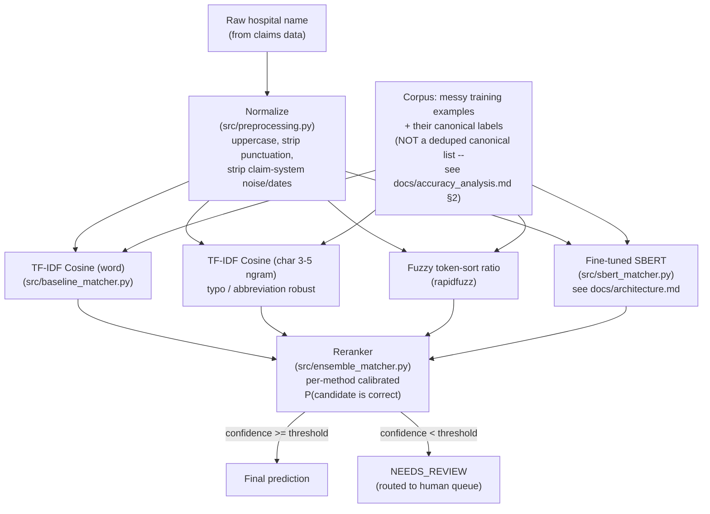

# Hospital Name Matching

Match messy, claim-system hospital names (e.g. `"REVIEW DOR 22 RS
BETHESDA YOGYAKARTA"`) to a clean canonical reference name (e.g.
`"RS BETHESDA YOGYAKARTA"`), using TF-IDF cosine similarity, fuzzy string
matching, and a domain-fine-tuned SBERT model combined in a reranking
ensemble.

> **The original notebooks' 88-90% accuracy figures are not real** — the
> decision logic in three of the four notebooks checks each candidate
> against the test set's ground-truth answer before picking it (textbook
> test-set leakage), and the "SBERT" notebook's SBERT step never actually
> ran (`ModuleNotFoundError` crash right after `pip install`). See
> [`docs/accuracy_analysis.md` §1](docs/accuracy_analysis.md#1-the-leakage-bug-in-the-original-notebooks)
> for the line-by-line proof. This repo replaces that pipeline with a
> leak-free one: a domain-fine-tuned multilingual SBERT plus a calibrated
> reranking ensemble. Honest, leak-free accuracy is **64-77%** on the
> resolved subset (vs. ~48-54% for any single lexical method), with a
> tunable confidence threshold that trades coverage for higher accuracy,
> and a measured hard ceiling of 70-85% (some answers aren't reachable at
> all) — see
> [`docs/accuracy_analysis.md`](docs/accuracy_analysis.md) for the full
> numbers and [`results/metrics_summary.json`](results/metrics_summary.json)
> for the raw output (run [§ Reproduce](#reproduce) to regenerate it).

## What this project demonstrates

- **Fine-tuned a multilingual SBERT bi-encoder** (`paraphrase-multilingual-MiniLM-L12-v2`)
  with contrastive learning (`MultipleNegativesRankingLoss`) on ~47k
  domain (messy → canonical) hospital-name pairs — [`src/finetune_sbert.py`](src/finetune_sbert.py).
- **Built a calibrated reranking ensemble** over four matchers (word
  TF-IDF cosine, char-ngram cosine, fuzzy, SBERT) with per-method
  logistic-regression confidence calibration and confidence-based routing
  to a human-review queue — [`src/ensemble_matcher.py`](src/ensemble_matcher.py).
- **Found and fixed test-set leakage** in the original notebooks that had
  inflated reported accuracy from a real ~50% baseline to a misleading
  ~89% — see [`docs/accuracy_analysis.md` §1](docs/accuracy_analysis.md#1-the-leakage-bug-in-the-original-notebooks).
- **Measured the hard retrieval ceiling** (70% / 85% — the share of test
  rows whose correct answer is even reachable in the corpus) to separate
  model headroom from irreducible data limits, then closed the winnable
  gap with a **char-ngram matcher** targeting the typo/abbreviation error
  bucket — [`docs/accuracy_analysis.md` §3](docs/accuracy_analysis.md#3-the-hard-ceiling-whats-the-maximum-any-matcher-could-score).
- **Ran a with-vs-without-SBERT ablation** to measure, rather than assume,
  deep learning's contribution: SBERT is among the strongest *standalone*
  matchers and uniquely recovers semantically-hard cases (cross-lingual
  synonyms, abbreviation expansion, names buried in free-text notes),
  while classical methods + calibration are competitive on headline
  accuracy for this lexical-error-dominated dataset — [`docs/accuracy_analysis.md` §5](docs/accuracy_analysis.md#5-does-sbert-actually-help-ablation).

## Architecture



SBERT's own internals (bi-encoder pooling, the contrastive fine-tuning
setup, inference flow) are diagrammed separately in
[`docs/architecture.md`](docs/architecture.md).

## Repo layout

```
data/
  raw/          Hospital_Train(.csv|_new.csv), Hospital_Test(.csv|_new.csv)
  processed/    saved prediction exports (.xlsx) from the original notebooks
notebooks/      original exploratory notebooks (TF-IDF/cosine/fuzzy/LogReg/SBERT)
src/
  preprocessing.py     shared text cleaning
  baseline_matcher.py  TF-IDF cosine + fuzzy scorers
  sbert_matcher.py     SBERT nearest-neighbor scorer
  finetune_sbert.py    domain fine-tuning of SBERT on this project's data
  ensemble_matcher.py  calibrated reranker over all four scorers (eval/research)
  evaluate.py          end-to-end accuracy report (baselines vs ensemble)
  ablation_sbert.py    with-vs-without-SBERT + SBERT's unique semantic wins
  pipeline.py          PRODUCTION cascade: cheap stages first, SBERT lazily
models/         fine-tuned SBERT weights (generated locally, gitignored)
results/        evaluate.py / ablation output: per-row predictions + JSON metrics
docs/
  architecture.md       SBERT architecture (Mermaid diagrams)
  accuracy_analysis.md  leakage findings, honest numbers, SBERT ablation
```

## Reproduce

```bash
pip install -r requirements.txt

# 1. Fine-tune SBERT on this project's (messy_name -> canonical_name) pairs
python src/finetune_sbert.py --epochs 1 --batch-size 32

# 2. Evaluate baselines + the fine-tuned ensemble on both test sets
python src/evaluate.py

# 3. Ablation: how much does SBERT actually add, and where uniquely?
python src/ablation_sbert.py

cat results/metrics_summary.json results/ablation_sbert.json
```

## Production use (CPU / office-laptop friendly)

[`src/pipeline.py`](src/pipeline.py) is a **staged cascade** built for
deployment without a GPU. Each row exits at the first stage confident
enough to answer, so the cheap stages handle the bulk and the expensive
SBERT stage only runs on the small low-confidence residual — and SBERT is
**loaded lazily**, so if every row resolves earlier the model is never
even loaded:

```
0. noise gate  -> claim-note garbage (no hospital keyword) => NEEDS_REVIEW
1. exact match -> normalized text already a known name      => instant, conf 1.0
2. lexical     -> char-ngram + word cosine + fuzzy (calibrated)  [CPU workhorse]
3. sbert       -> only the low-confidence residual (semantic cases)
4. review      -> still unsure => human queue
```

```python
from pipeline import HospitalMatcher

m = HospitalMatcher.load_or_build()   # build once (~90s), then loads in <1s
m.predict_one("RSSTELISABETH SEMARANG")
# {'prediction': 'RS ST ELISABETH SEMARANG', 'confidence': 1.0,
#  'stage': 'exact', 'needs_review': False, ...}

m.predict_batch(["APOTIK ASEAN JAYA", "HOSPITAL PAKAR DAMANSARA KL"])  # -> DataFrame
```

Tunables: `lexical_threshold`, `sbert_threshold` (raise for higher
auto-accuracy + more human review), `noise_min_words`. The fitted lexical
state and the corpus SBERT embeddings are cached to `models/`
(gitignored) so day-to-day startup is sub-second. Per-row output includes
the chosen `stage`, calibrated `confidence`, and a `needs_review` flag for
routing.

## Original notebooks (kept for reference — accuracy figures are leaked, see warning above)

| Notebook | Method | Reported accuracy | Leak-free? |
|---|---|---|---|
| `01_cosine_fuzzy_baseline.ipynb` | TF-IDF cosine → fuzzy fallback | 87.9% (`Hospital_Test.csv`) | No — checks candidates against `y_test` before picking |
| `02_logreg_cosine_fuzzy.ipynb` | Cosine/fuzzy/LogReg, decided by score **thresholds** | 61.3% (`Hospital_Test_new.csv`) | **Yes** — the only one of the four; lowest number because it's the only honest one |
| `03_cosine_fuzzy_sbert.ipynb` | Cosine → fuzzy → SBERT (SBERT crashed, never ran) | 88.8% (`Hospital_Test.csv`) | No — same leak as #1; also doesn't actually include SBERT |
| `04_tfidf_cosine_logreg_hybrid_test.ipynb` | TF-IDF cosine + LogReg | 90.3% (`Hospital_Test.csv`) | No — same leak pattern (`cosine_preds[i]==y_test.iloc[i]`) |

This repo's `src/evaluate.py` is leak-free by construction (see
`docs/accuracy_analysis.md` §2 for the two additional measurement bugs
that had to be fixed to get there) — its numbers are directly comparable
to notebook 02's, not to 01/03/04's.
