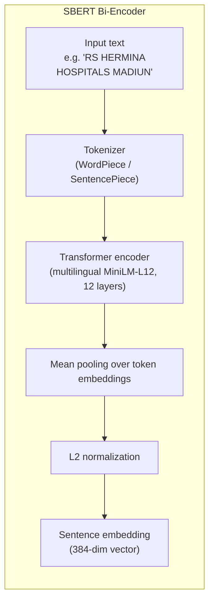
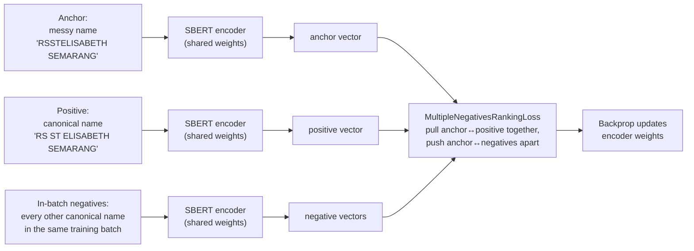
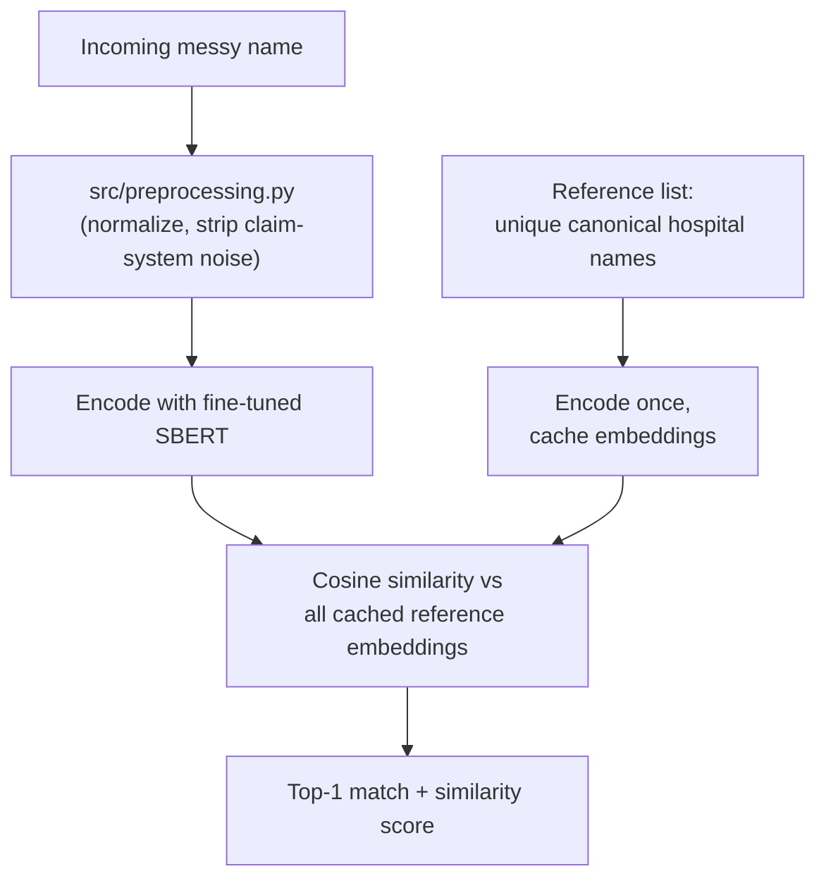

# SBERT Architecture

This document explains the SBERT-based component of the matching pipeline:
what SBERT is, why it was chosen, how it is fine-tuned for hospital names
specifically, and how it fits into the full ensemble.

## 1. Why SBERT instead of plain BERT

A vanilla BERT encodes a sentence into per-token vectors; to compare two
hospital names you'd have to run BERT once per *pair* (cross-encoder),
which is O(n²) and far too slow for matching one messy name against a
reference list of thousands of canonical names.

**Sentence-BERT (SBERT)** instead fine-tunes BERT with a pooling layer so
that **one fixed-size vector represents the whole sentence**, and that
vector space is shaped so cosine similarity between two vectors reflects
semantic similarity between the two sentences. That means:

- Reference names are embedded **once** and cached.
- A new query name is embedded once and compared to all cached reference
  vectors with simple cosine similarity (vector math, no model
  inference per pair).

This is what makes SBERT usable as a real-time nearest-neighbor matcher
instead of a one-off classifier.

## 2. Base architecture

Base model: `paraphrase-multilingual-MiniLM-L12-v2`
(swapped in from the original `paraphrase-MiniLM-L6-v2`, which is
English-only — most reference names here are Indonesian/Singaporean).

## 3. Domain fine-tuning (this is the part that moves accuracy)

Off-the-shelf SBERT has never seen "RSUD", "RSIA" or claim-system noise
phrases — it has no reason to know that `"RS HERMINA HOSPITALS MADIUN"`
and `"RS HERMINA MADIUN"` should land near each other in vector space.
We fine-tune it on this project's own (messy_name → canonical_name)
pairs using **contrastive learning**:

- **Anchor** = a raw/messy hospital name as it appears in claims data.
- **Positive** = its correct canonical reference name.
- **Negatives** = every *other* canonical name that happens to be in the
  same training batch (no manual negative mining needed).
- **Loss**: `MultipleNegativesRankingLoss` — a standard retrieval loss
  that directly optimizes "the correct match should have the highest
  cosine similarity among all candidates in the batch," which is
  exactly the task this project needs at inference time.

Training script: [`src/finetune_sbert.py`](../src/finetune_sbert.py).
Output: a fine-tuned model directory at `models/sbert-hospital-matcher/`
(not committed to git — regenerate it locally with the script).

## 4. Inference / matching flow

Implementation: [`src/sbert_matcher.py`](../src/sbert_matcher.py).

## 5. Where SBERT sits in the full pipeline

SBERT is one of three scorers feeding the reranking ensemble — see
[`src/ensemble_matcher.py`](../src/ensemble_matcher.py) and the system
diagram in the main [README](../README.md#architecture). It is the
scorer most robust to **word reordering, synonyms, and abbreviation
variants** (e.g. "ortho" vs "orthopedi"), which is precisely the failure
mode where TF-IDF cosine and character-level fuzzy matching struggle —
see [accuracy_analysis.md](accuracy_analysis.md) for the mismatch
breakdown that motivated this design.
